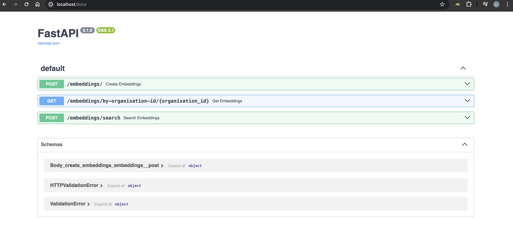

# Introduce project requirement #

## Overview ##
Build a basic CRUD application using FastAPI, Postgres and Qdrant/Fastembed. The API endpoint will support both creation and retrieval of embedded documents.

### Requirements ###
- Use Python 3.11 (or 3.10 if you find compatibility issues)
- Do NOT use sqlalchemy for postgres, use “psycopg v3” and regular sql statements
- Three test .txt documents have been provided to verify functionality, use these for testing

### Desired Flow ###
Full details are provided below, but the full final flow should approximately look like the following:
- POST calls to /embeddings with each txt document and body parameters
Store in Qdrant with FastEmbed to generate embeddings and store with parameters as payload
- Store in Postgres table including with FastEmbed id
- GET call to /embeddings/by-organisation-id/{organisation_id} with the chosen organisation id returns all the files with associated metadata
- POST call to /embeddings/search with “query” set to “a statement about sports” and type “.txt” returns the document metadata of “soccer.txt” and “tennis.txt” but not “food.txt” (or at least soccer.txt and tennis.txt should rank higher by similarity).

## Creation ##
### FastAPI ###
POST /embeddings endpoint which accepts:
- A file (.txt file)
- project (str)
- organisation_id (str)

### Qdrant ###
**Directions**: https://qdrant.tech/

- Use Qdrant and FastEmbed to embed and store the txt document contents and metadata
  - Use the BAAI/bge-small-en-v1.5 for the embeddings model (can find it supported here)
  - Store filename, content, type, project and organisation_id as metadata for file (in the Qdrant payload)

**Desired Result**

Three entries in a Qdrant collection with all metadata and correct embeddings for all 3 txt files.

### Postgres ###
**Directions**: 

Note: Remember to use psycopg v3.

A table called  “embedding” with the following columns:
- filename (str): name of provided file
- content (str): text content of the .txt file
- type (str): make it the extension, so “.txt” for this example
- project (str): Request project value
- organisation_id (str): Request organisation_id value
- embedding_id (str): Id returned from the Qdrant embedding entry


**Desired Result**

Three entries in the Postgres database table with all fields populated accurately for the three dummy .txt files.


### Postgres ###
Perform a similarity search on the qdrant database using the BAAI/bge-small-en-v1.5 model.
 - POST /embeddings/search
   - Body:
      - query (str): Text query for similarity search
      - type (str): Type to filter by, for test it will be “.txt”
    
**Desired Result**

- When given the query of “a statement about sports” it should return only the data for files “soccer.txt” and “tennis.txt”, NOT “food.txt”.
- Note: You can set a score_threshold if required to help filter results by similarity


# Introduce project #

## 1. Project structure ##

- docker-compose.yml: Provide íntruction to build infrastructure which are used in this project.
- app:
  - Dockerfile: an instruction file to build app image (using python version 3.10 as well as install all python lib which are used in this service)
  - main.py: main fastapi app
  - utils: utils folder include all of util python file
    - pg_integrate.py: include a class integrate with postgresql
    - qrant_integrate.py: include a class integrate with qdrant
    - response_model.py include response model which will be used to format the result when calling API.
    - settings.py: include environment params.

## How to run this project at local environment ##
1. Install Docker
2. Run this command line in the terminal:
```
 docker compose up --build
 ``` 
3. Open browser and access to this page:
```
http://localhost:80/docs
```



## Test API ##
### /embeddings ###
- POST calls to /embeddings with each txt document and body parameters
Store in Qdrant with FastEmbed to generate embeddings and store with parameters as payload
- Store in Postgres table including with FastEmbed id

call api to store document: cooking.txt file


call api to store document: soccer.txt file
 

call api to store document: tennis.txt file
 


### /embeddings/by-organisation-id/{organisation_id}  ###
GET call to /embeddings/by-organisation-id/{organisation_id} with the chosen organisation id returns all the files with associated metadata
Response if success:
```
{
  "documents": [
    {
      "filename": "cooking.txt",
      "content": "a general discussion regarding food, from traveling, to cooking, to eating it.\n",
      "type": "txt",
      "project": "project_1",
      "organisation_id": "organisation_id",
      "embedding_id": "af664d7cfa2245e387a42267098c070a"
    },
    {
      "filename": "soccer.txt",
      "content": "a document which talks about soccer\n",
      "type": "txt",
      "project": "project_1",
      "organisation_id": "organisation_id",
      "embedding_id": "162e045f7d2f49b89e20fb7c38726335"
    },
    {
      "filename": "tennis.txt",
      "content": "a document which details some things about the game of tennis.\n\n",
      "type": "txt",
      "project": "project_1",
      "organisation_id": "organisation_id",
      "embedding_id": "d32306c2f9b245adbc26d74696f67c4b"
    }
  ]
}
```
 

Response if not found:
```
{
  "response": "not found"
}
```
 


### /embeddings/search  ###
POST call to /embeddings/search with “query” set to “a statement about sports” and type “.txt” returns the document metadata of “soccer.txt” and “tennis.txt” but not “food.txt” (or at least soccer.txt and tennis.txt should rank higher by similarity).
- When given the query of “a statement about sports” it should return only the data for files “soccer.txt” and “tennis.txt”, NOT “food.txt”.
- Note: set a score_threshold = 0.75

Response:
```
{
  "documents": [
    {
      "filename": "soccer.txt",
      "score": "0.78215"
    },
    {
      "filename": "tennis.txt",
      "score": "0.7616104"
    }
  ]
}
```

 